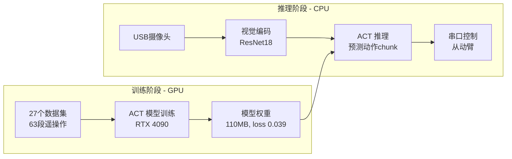
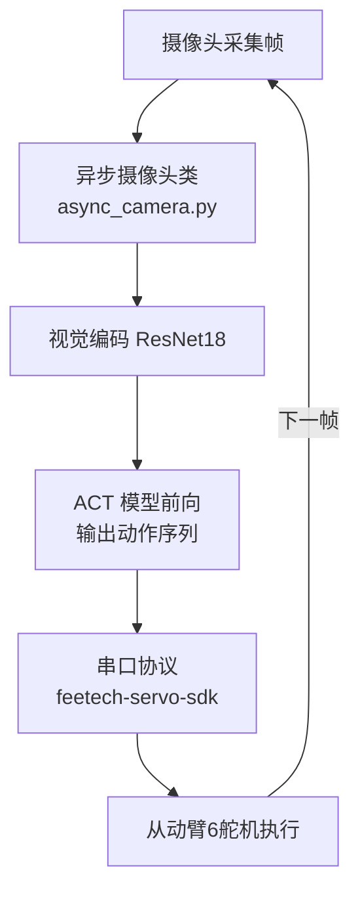
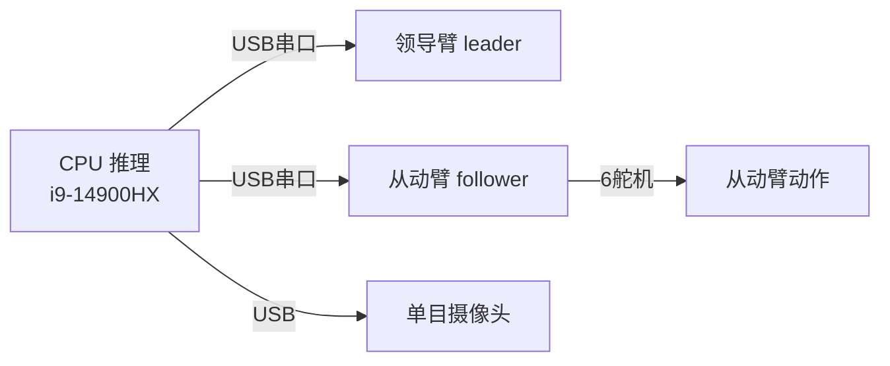

# 架构图 · SO101 机械臂 ACT 推理

## 整体闭环

## 推理控制流程

## 硬件链路

## 关键架构决策

| 决策 | 原因 |
|------|------|
| 训练 GPU / 推理 CPU 分离 | 训练需要 RTX 4090 云端，推理只需 i9 本机实时 |
| 异步摄像头 | 摄像头帧率不阻塞推理主循环，`async_camera.py` 解耦 |
| 纯视觉推理与完整控制分离 | `inference.py` 不连机械臂可安全测试，`inference_control.py` 才接串口 |
| udev 固定端口 | 两个串口固定符号链接，避免重启后 ttyACM 编号漂移 |
| LeRobot 补丁 | 0.4.3 缺 DEFAULT_FEATURES 定义，源码补丁解决 |
