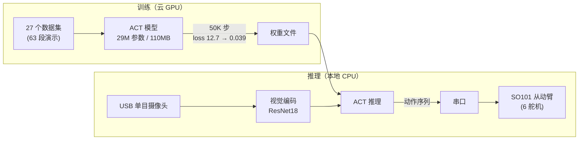

# SO101 单臂机械臂 ACT 模型推理控制

> 端到端具身智能：从数据采集、GPU 训练，到 CPU 推理 + 串口控制从动臂的完整闭环

[](https://python.org)
[](https://pytorch.org)
[](https://github.com/huggingface/lerobot)

---

## 📌 Problem（背景与问题）

机械臂的难点不在「能不能动」，而在**「能不能学会一个操作」**。传统做法（示教编程 / 逆运动学求解）每换一个任务就要重写一遍程序，且对「拿起、放下、对齐」这类需要判断的动作很不友好。

SO101 是一台低成本单臂（6 舵机）机械臂，没有商业级运动学套件。**问题**：能不能用「数据驱动」的方式，让它通过看人演示 + 摄像头观察，自己学会一个抓取动作？

## 🤖 Why ACT（为什么用模仿学习，而不是传统编程）

ACT（Action Chunking Transformer）是具身智能里主流的**模仿学习**范式：

- **输入**：摄像头实时画面（观察）
- **输出**：一段连续动作序列（chunk），而非单步动作
- **原理**：预测未来 50 步的动作「块」，减少单步预测的抖动，让动作更平滑、更接近人的连贯操作

选它的理由：**它把「怎么编程控制机械臂」变成了「喂数据让它学」**——不需要手写运动学方程，只需要演示数据 + 一张 4090 跑训练。

## 🏗️ Architecture（架构）



- **训练**：RTX 4090 云 GPU，46 分钟，loss 从 12.7 收敛到 0.039
- **推理**：本地 CPU 实时跑，摄像头 → 模型 → 串口 → 从动臂，不依赖云
- **安全分层**：`inference.py`（纯视觉，不连臂，安全测试）→ `inference_control.py`（完整控制）

## 🛠️ Skills（能力模块）

| 模块 | 文件 | 能力 |
|------|------|------|
| 👁️ 视觉 | `vision/` | 摄像头封装 · HSV 颜色识别 · 纸面四角标定 |
| 🧠 推理 | `src/inference.py` | 纯视觉推理（不连从动臂，安全验证） |
| 🦾 控制 | `src/inference_control.py` | 摄像头+模型+串口+从动臂完整闭环 |
| 🔧 诊断 | `src/servo_test.py` | 舵机硬件诊断 |
| 🎬 采集 | `scripts/` | 一键遥操作 / 一键数据采集 |

## 🧰 Tools（技术栈）

- **框架**：LeRobot 0.4.3（含 DEFAULT_FEATURES 补丁）· PyTorch 2.7.1
- **硬件**：SO101 主从臂 · USB 单目摄像头 · 6 个 feetech 舵机
- **环境**：VirtualBox Ubuntu 22.04 · conda `robot_arm` · OpenCV 4.12
- **驱动**：feetech-servo-sdk · udev 固定端口

## 🧠 Memory（模型的「记忆」）

ACT 模型的「记忆」就是那 **27 个数据集（63 段演示）**——它没有显式编程的规则，所有行为都来自这 63 段人类演示的统计归纳。这也解释了它为什么：

- 见过类似场景 → 动作顺畅
- 遇到没见过的新位置 → 动作会「犹豫」或偏掉（泛化边界）

## 📊 Eval（评估 / 验证）

| 指标 | 值 |
|------|-----|
| 模型 | ACT（Action Chunking Transformer） |
| 视觉骨干 | ResNet18（ImageNet 预训练） |
| chunk_size | 50 |
| 训练步数 | 50,000 |
| 最终 loss | **0.039**（从 12.7 收敛） |
| 训练时长 | 46 分钟 |
| GPU | RTX 4090 24GB（Compshare） |
| 推理硬件 | 本地 CPU（实时） |

验证路径：先 `inference.py` 纯视觉跑通 → 再 `inference_control.py` 接从动臂 → `servo_test.py` 诊断硬件。

## 💥 Failure Cases（失败案例 / 踩坑）

完整记录见 `docs/20个踩坑记录.md`，每条都标了根因。代表性几条：

1. **从动臂排线接反**——通电后舵机乱抖，一度以为是模型问题，最后定位是硬件排线。教训：先验硬件再查软件。
2. **LeRobot 源码编译缺 DEFAULT_FEATURES**——官方源码直接装会缺特性，需手动补丁。
3. **摄像头帧率 vs 模型推理速度不匹配**——异步摄像头（`async_camera.py`）解耦采集和推理，避免帧堆积。

> 这些坑让我建立了「**硬件 → 驱动 → 环境 → 模型**」的排查顺序，而不是一上来就怀疑模型。

## 🎨 Design Decisions（设计决策）

| 决策 | 理由 | 代价 |
|------|------|------|
| ACT 而非 RL/传统控制 | 模仿学习对低成本硬件最友好，数据驱动 | 泛化受演示数据限制 |
| CPU 实时推理而非 GPU | 实际部署场景无 GPU，验证可行性 | 推理速度受限 |
| 纯视觉（无状态传感器） | 简化硬件，只靠摄像头观察 | 对遮挡/新视角敏感 |
| 云 GPU 训练 + 本地推理 | 训练贵、推理便宜，分离最优 | 权重需手动搬运 |

## 🚀 快速开始

```bash
conda activate robot_arm
cd src/
python inference.py            # 纯视觉推理（安全，不连臂）
python inference_control.py    # 完整控制（连从动臂+摄像头）
python servo_test.py           # 舵机诊断
```

## 📁 目录结构

```
├── src/            # 推理/控制/诊断/训练启动
├── scripts/        # 遥操作 + 数据采集
├── vision/         # 摄像头 / 颜色识别 / 标定
├── docs/           # 20个踩坑记录 / ROS2核心概念 / GPU操作全记录
└── config/         # udev 端口规则
```

## License

MIT
